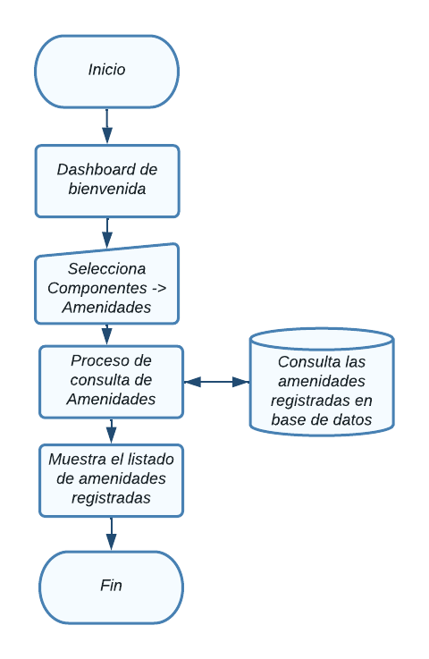

# Amenidades

En esta sección se abordarán el Módulo de amenidades.

Para acceder a cada uno, haga clic en el módulo Componentes ->  amenidades.

  

NOTA: Debe tener un rol como *super_admin*, o tener un perfil con los permisos
necesarios para poder crear amenidades, roles y permisos.

## Tabla de contenido

- [Amenidades](#amenidades)
  - [Tabla de contenido](#tabla-de-contenido)
  - [Consultar amenidades](#consultar-amenidades)
    - [Diagrama de flujo - Ver amenidades](#diagrama-de-flujo---ver-amenidades)
  - [Agregar amenidad](#agregar-amenidad)
    - [Diagrama de flujo - Agregrar amenidad](#diagrama-de-flujo---agregrar-amenidad)
  - [Modificar amenidad](#modificar-amenidad)
    - [Diagrama de flujo - Modificación de amenidad](#diagrama-de-flujo---modificación-de-amenidad)
  - [Eliminación de  amenidad](#eliminación-de--amenidad)
    - [Diagrama de flujo - Eliminación de amenidad](#diagrama-de-flujo---eliminación-de-amenidad)

## Consultar amenidades
Aparecerá en pantalla el listado de todas las amenidades registradas y la información relevante de cada una y las opciones agregar, modificar y eliminar, las cuales detallaremos a continuación. 

### Diagrama de flujo - Ver amenidades

## Agregar amenidad
Desde la sección de amenidades de clic en el botón **Agregar amenidad**, lo llevara a la sección **Crear amenidad.**  

Aparecerá el siguiente formulario con diversos campos importantes para el
registro de nuevas amenidades

Al finalizar el llenado de los campos es necesario dar clic en **Submit**, de lo contrario los cambios no se verán reflejados

### Diagrama de flujo - Agregrar amenidad

## Modificar amenidad
Desde la sección de amenidades de clic en **Editar amenidad** de la amenidad que desea modificar y lo llevara a la sección **Modificar amenidad.**  

Aparecerá el siguiente formulario con la información de la amenidad.

Al finalizar el llenado de los campos es necesario dar clic en **Submit**, de lo contrario los cambios no se verán reflejados

### Diagrama de flujo - Modificación de amenidad

## Eliminación de  amenidad
Desde la sección de amenidades de clic en el botón **Eliminar** de la amenidad que desea eliminar y le mostrará un mensaje de confirmación

Aparecerá el siguiente mensaje de confirmación:

Puede cancelar la acción si no esta seguro de eliminar el registro, al dar click en el botón **Ok** la amenidad se eliminará y no se podrá recuperar el registro.

### Diagrama de flujo - Eliminación de amenidad
