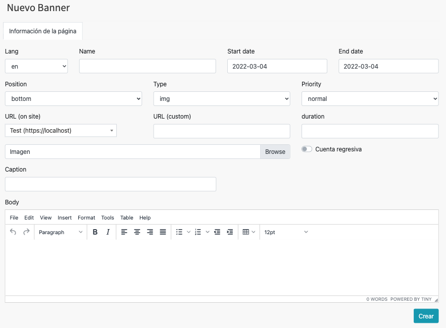
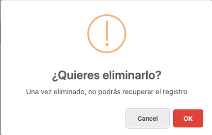

# Banners

En esta sección se abordarán el Módulo de banners.

Para acceder a cada uno, haga clic en el módulo Componentes ->  banners.

  

NOTA: Debe tener un rol como *super_admin*, o tener un perfil con los permisos
necesarios para poder crear banners, roles y permisos.

## Tabla de contenido

- [Banners](#banners)
  - [Tabla de contenido](#tabla-de-contenido)
  - [Consultar banners](#consultar-banners)
    - [Diagrama de flujo - Ver banners](#diagrama-de-flujo---ver-banners)
  - [Agregar banner](#agregar-banner)
    - [Diagrama de flujo - Agregrar banner](#diagrama-de-flujo---agregrar-banner)
  - [Modificar banner](#modificar-banner)
    - [Diagrama de flujo - Modificación de banner](#diagrama-de-flujo---modificación-de-banner)
  - [Eliminación de  banner](#eliminación-de--banner)
    - [Diagrama de flujo - Eliminación de banner](#diagrama-de-flujo---eliminación-de-banner)

## Consultar banners
Aparecerá en pantalla el listado de todas las banners registradas y la información relevante de cada una y las opciones agregar, modificar y eliminar, las cuales detallaremos a continuación. 

<!--  -->

### Diagrama de flujo - Ver banners

## Agregar banner
Desde la sección de banners de clic en el botón **Agregar banner**, lo llevara a la sección **Crear banner.**  

Aparecerá el siguiente formulario con diversos campos importantes para el
registro de nuevos banners

Al finalizar el llenado de los campos es necesario dar clic en **Submit**, de lo contrario los cambios no se verán reflejados

### Diagrama de flujo - Agregrar banner

## Modificar banner
Desde la sección de banners de clic en **Editar banner** del banner que desea modificar y lo llevara a la sección **Modificar banner.**  

Aparecerá el siguiente formulario con la información del banner.

<!--  -->

Al finalizar el llenado de los campos es necesario dar clic en **Submit**, de lo contrario los cambios no se verán reflejados

### Diagrama de flujo - Modificación de banner

## Eliminación de  banner
Desde la sección de banners de clic en el botón **Eliminar** del banner que desea eliminar y le mostrará un mensaje de confirmación

Aparecerá el siguiente mensaje de confirmación:

Puede cancelar la acción si no esta seguro de eliminar el registro, al dar click en el botón **Ok** el banner se eliminará y no se podrá recuperar el registro.

### Diagrama de flujo - Eliminación de banner
