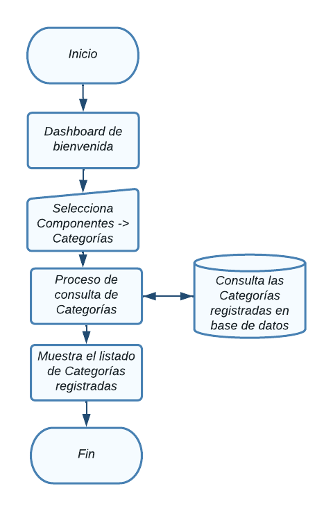

# Categorías

En esta sección se abordarán el Módulo de categorias.

Para acceder a cada uno, haga clic en el módulo Componentes ->  categorias.

  

NOTA: Debe tener un rol como *super_admin*, o tener un perfil con los permisos
necesarios para poder crear categorias, roles y permisos.

## Tabla de contenido

- [Categorías](#categorías)
  - [Tabla de contenido](#tabla-de-contenido)
  - [Consultar categorías](#consultar-categorías)
    - [Diagrama de flujo - Ver categorías](#diagrama-de-flujo---ver-categorías)
  - [Agregar categoría](#agregar-categoría)
    - [Diagrama de flujo - Agregrar categoría](#diagrama-de-flujo---agregrar-categoría)
  - [Modificar categoría](#modificar-categoría)
    - [Diagrama de flujo - Modificación de categoría](#diagrama-de-flujo---modificación-de-categoría)
  - [Eliminación de  categoría](#eliminación-de--categoría)
    - [Diagrama de flujo - Eliminación de categoría](#diagrama-de-flujo---eliminación-de-categoría)

## Consultar categorías
Aparecerá en pantalla el listado de todas las categoría registradas y la información relevante de cada una y las opciones agregar, modificar y eliminar, las cuales detallaremos a continuación. 

### Diagrama de flujo - Ver categorías

## Agregar categoría
Desde la sección de categorías de clic en el botón **Agregar categoría**, lo llevara a la sección **Crear categoría.**  

Aparecerá el siguiente formulario con diversos campos importantes para el
registro de nuevas categorías

Al finalizar el llenado de los campos es necesario dar clic en **Submit**, de lo contrario los cambios no se verán reflejados

### Diagrama de flujo - Agregrar categoría

## Modificar categoría
Desde la sección de categorías de clic en **Editar categoría** de la categoría que desea modificar y lo llevara a la sección **Modificar categoría.**  

Aparecerá el siguiente formulario con la información de la categoría.

Al finalizar el llenado de los campos es necesario dar clic en **Submit**, de lo contrario los cambios no se verán reflejados

### Diagrama de flujo - Modificación de categoría

## Eliminación de  categoría
Desde la sección de categorías de clic en el botón **Eliminar** de la categoría que desea eliminar y le mostrará un mensaje de confirmación

Aparecerá el siguiente mensaje de confirmación:

Puede cancelar la acción si no esta seguro de eliminar el registro, al dar click en el botón **Ok** la categoría se eliminará y no se podrá recuperar el registro.

### Diagrama de flujo - Eliminación de categoría
