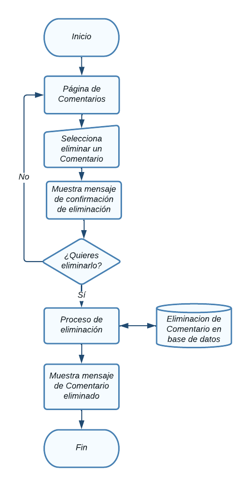

# Comentarios

En esta sección se abordarán el Módulo de comentarios.

Para acceder a cada uno, haga clic en el módulo Componentes ->  comentarios.

  

NOTA: Debe tener un rol como *super_admin*, o tener un perfil con los permisos
necesarios para poder crear comentarios, roles y permisos.

## Tabla de contenido

- [Comentarios](#comentarios)
  - [Tabla de contenido](#tabla-de-contenido)
  - [Consultar comentarios](#consultar-comentarios)
    - [Diagrama de flujo - Ver comentarios](#diagrama-de-flujo---ver-comentarios)
  - [Agregar comentario](#agregar-comentario)
    - [Diagrama de flujo - Agregrar comentario](#diagrama-de-flujo---agregrar-comentario)
  - [Modificar comentario](#modificar-comentario)
    - [Diagrama de flujo - Modificación de comentario](#diagrama-de-flujo---modificación-de-comentario)
  - [Eliminación de  comentario](#eliminación-de--comentario)
    - [Diagrama de flujo - Eliminación de comentario](#diagrama-de-flujo---eliminación-de-comentario)

## Consultar comentarios
Aparecerá en pantalla el listado de todas las comentarios registradas y la información relevante de cada una y las opciones agregar, modificar y eliminar, las cuales detallaremos a continuación. 

### Diagrama de flujo - Ver comentarios

## Agregar comentario
Desde la sección de comentarios de clic en el botón **Agregar comentario**, lo llevara a la sección **Crear comentario.**  

Aparecerá el siguiente comentario con diversos campos importantes para el
registro de nuevos comentarios

Al finalizar el llenado de los campos es necesario dar clic en **Submit**, de lo contrario los cambios no se verán reflejados

### Diagrama de flujo - Agregrar comentario

## Modificar comentario
Desde la sección de comentarios de clic en **Editar comentario** del comentario que desea modificar y lo llevara a la sección **Modificar comentario.**  

Aparecerá el siguiente comentario con la información del comentario.

Al finalizar el llenado de los campos es necesario dar clic en **Submit**, de lo contrario los cambios no se verán reflejados

### Diagrama de flujo - Modificación de comentario

## Eliminación de  comentario
Desde la sección de comentarios de clic en el botón **Eliminar** del comentario que desea eliminar y le mostrará un mensaje de confirmación

Aparecerá el siguiente mensaje de confirmación:

Puede cancelar la acción si no esta seguro de eliminar el registro, al dar click en el botón **Ok** el comentario se eliminará y no se podrá recuperar el registro.

### Diagrama de flujo - Eliminación de comentario
