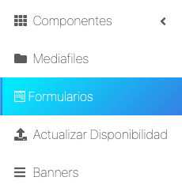
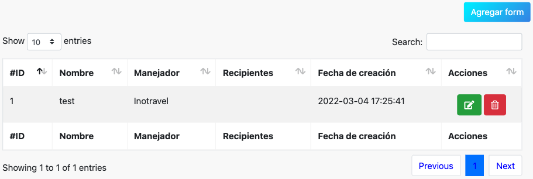
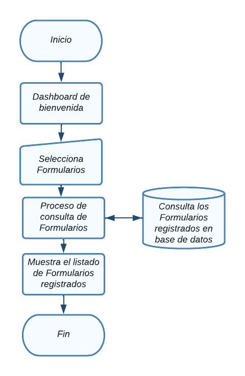
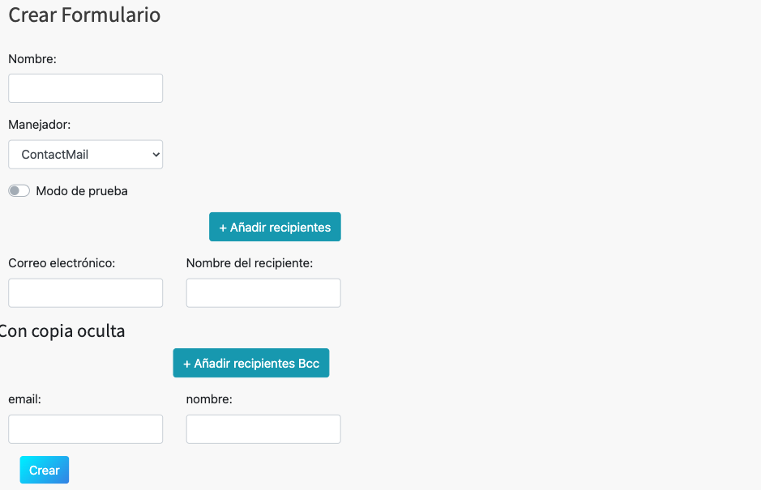
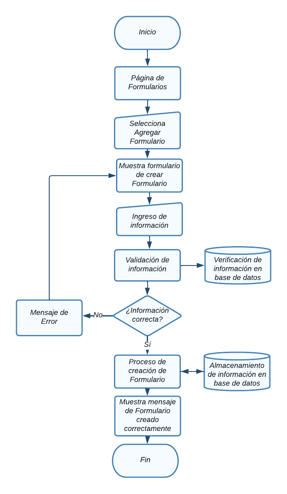
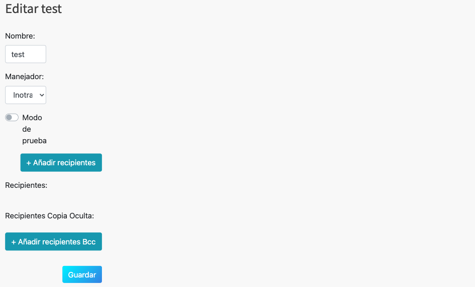
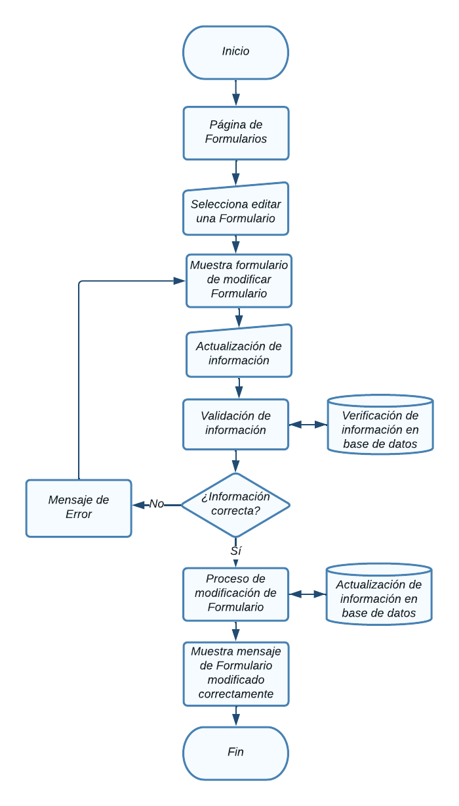
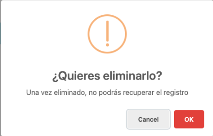
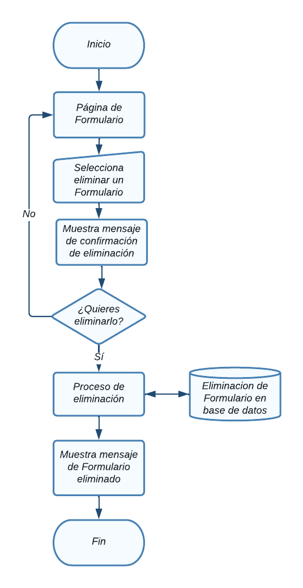

# Formularios

En esta sección se abordarán el Módulo de formularios.

Para acceder a cada uno, haga clic en el módulo Componentes ->  formularios.

  

NOTA: Debe tener un rol como *super_admin*, o tener un perfil con los permisos
necesarios para poder crear formularios, roles y permisos.

## Tabla de contenido

- [Formularios](#formularios)
  - [Tabla de contenido](#tabla-de-contenido)
  - [Consultar formularios](#consultar-formularios)
    - [Diagrama de flujo - Ver formularios](#diagrama-de-flujo---ver-formularios)
  - [Agregar formulario](#agregar-formulario)
    - [Diagrama de flujo - Agregrar formulario](#diagrama-de-flujo---agregrar-formulario)
  - [Modificar formulario](#modificar-formulario)
    - [Diagrama de flujo - Modificación de formulario](#diagrama-de-flujo---modificación-de-formulario)
  - [Eliminación de  formulario](#eliminación-de--formulario)
    - [Diagrama de flujo - Eliminación de formulario](#diagrama-de-flujo---eliminación-de-formulario)

## Consultar formularios
Aparecerá en pantalla el listado de todas las formularios registradas y la información relevante de cada una y las opciones agregar, modificar y eliminar, las cuales detallaremos a continuación. 

### Diagrama de flujo - Ver formularios

## Agregar formulario
Desde la sección de formularios de clic en el botón **Agregar formulario**, lo llevara a la sección **Crear formulario.**  

Aparecerá el siguiente formulario con diversos campos importantes para el
registro de nuevos formularios

Al finalizar el llenado de los campos es necesario dar clic en **Submit**, de lo contrario los cambios no se verán reflejados

### Diagrama de flujo - Agregrar formulario

## Modificar formulario
Desde la sección de formularios de clic en **Editar formulario** del formulario que desea modificar y lo llevara a la sección **Modificar formulario.**  

Aparecerá el siguiente formulario con la información del formulario.

Al finalizar el llenado de los campos es necesario dar clic en **Submit**, de lo contrario los cambios no se verán reflejados

### Diagrama de flujo - Modificación de formulario

## Eliminación de  formulario
Desde la sección de formularios de clic en el botón **Eliminar** del formulario que desea eliminar y le mostrará un mensaje de confirmación

Aparecerá el siguiente mensaje de confirmación:

Puede cancelar la acción si no esta seguro de eliminar el registro, al dar click en el botón **Ok** el formulario se eliminará y no se podrá recuperar el registro.

### Diagrama de flujo - Eliminación de formulario
