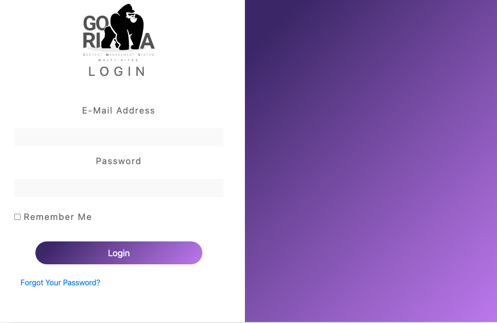

# MGCms2021

### Descripción General
Paquete para ambiente de trabajo *Laravel* que separa la responsabilidad de mantenimiento del *CMS* en sitios web hechos en casa por Marival Group.

Copyright 2021 Marival Group, todos los derechos reservados.

Este proyecto no contiene licencia y, por tanto, no está permitido su uso en proyectos web externos o ajenos a Marival Group sin consentimiento expreso de los autores y/o titulares de derechos de autor.

## Índice

- [Modelado de Base de datos](base-de-datos)
- [Implementación de CMS en nuevo proyecto Laravel](implementacion)  
- [Usuarios](usuarios)
  - [Roles](usuarios-roles)
  - [Permisos](usuarios-permisos)
- [Sitio](sitio)
- [Páginas](paginas)
- [Componentes](componentes)
  - [Amenidades](amenidades)
  - [Categorías](categorias)
  - [Servicios](servicios)
- [Mediafiles](mediafiles)
- [Formularios](formularios)
- [Banners](banners)
- [Comentarios](comentarios)
- [Redes sociales](redes-sociales)
- [Solicitud de Servicios](solicitud-de-servicios)

<!-- ![Login][login]

[login]: images/login.png "Login" -->
