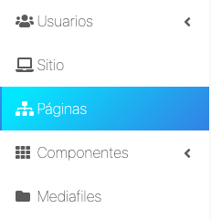
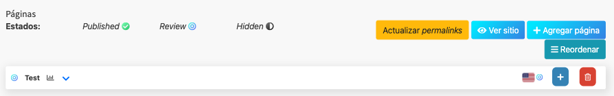
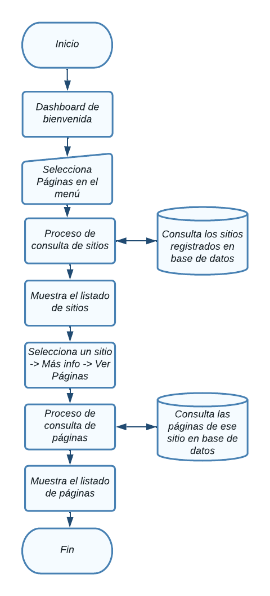
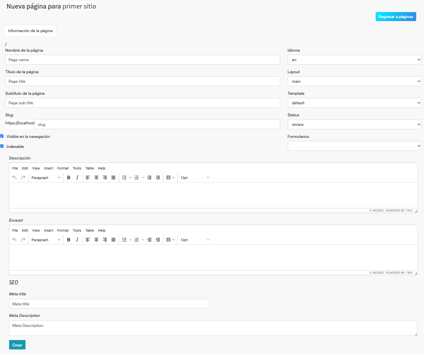
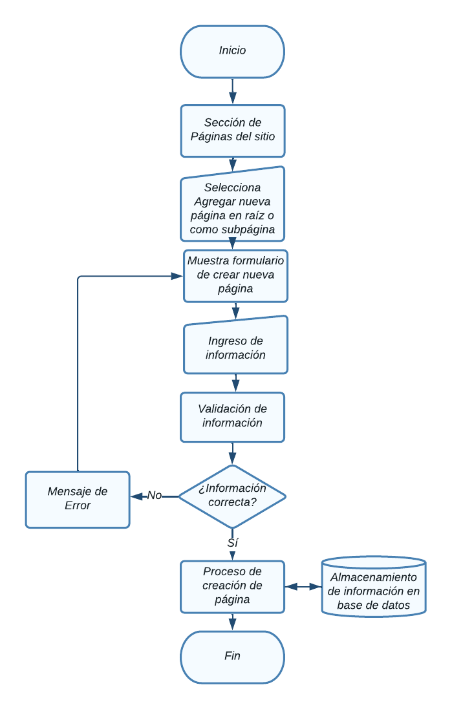
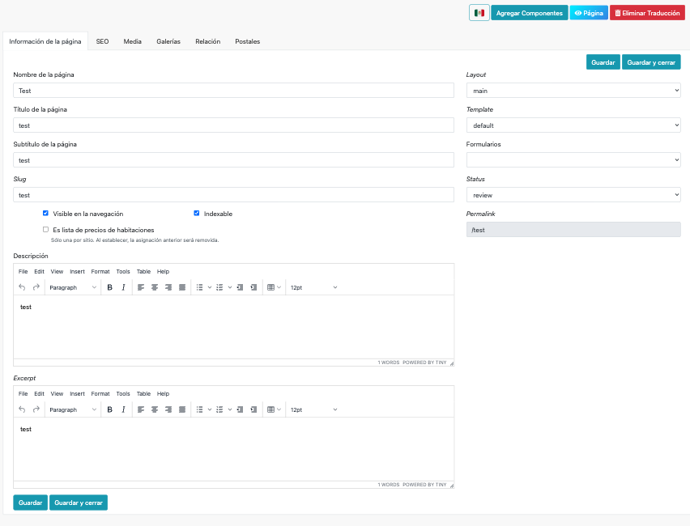
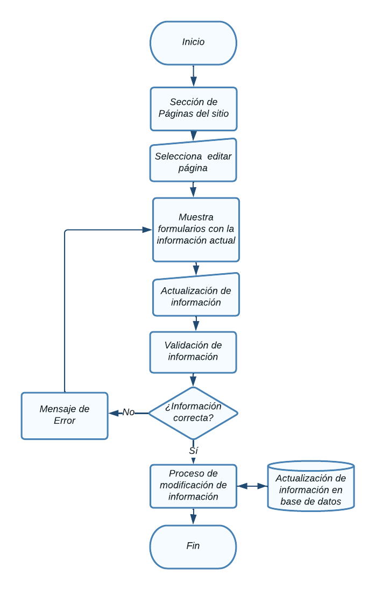
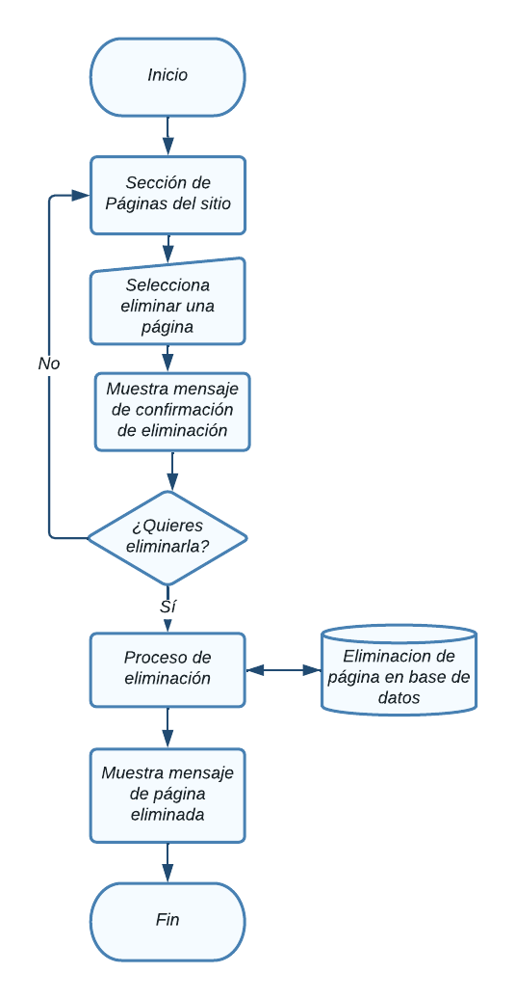

# Páginas

En esta sección se abordarán el Módulo de páginas.

Para acceder a cada uno, haga clic en el módulo Componentes -> Páginas.

  

NOTA: Debe tener un rol como *super_admin*, o tener un perfil con los permisos
necesarios para poder crear páginas, roles y permisos.

## Tabla de contenido

- [Páginas](#páginas)
  - [Tabla de contenido](#tabla-de-contenido)
  - [Consultar páginas](#consultar-páginas)
    - [Diagrama de flujo - Ver páginas](#diagrama-de-flujo---ver-páginas)
  - [Agregar página](#agregar-página)
    - [Diagrama de flujo - Agregrar página](#diagrama-de-flujo---agregrar-página)
  - [Modificar página](#modificar-página)
    - [Diagrama de flujo - Modificación de página](#diagrama-de-flujo---modificación-de-página)
  - [Eliminación de  página](#eliminación-de--página)
    - [Diagrama de flujo - Eliminación de página](#diagrama-de-flujo---eliminación-de-página)

## Consultar páginas
Aparecerá en pantalla el listado de todas las página registradas y la información relevante de cada una y las opciones agregar, modificar y eliminar, las cuales detallaremos a continuación. 

### Diagrama de flujo - Ver páginas

## Agregar página
Desde la sección de páginas de clic en el botón **Agregar página**, lo llevara a la sección **Crear página.**  

Aparecerá el siguiente formulario con diversos campos importantes para el
registro de nuevas páginas

Al finalizar el llenado de los campos es necesario dar clic en **Submit**, de lo contrario los cambios no se verán reflejados

### Diagrama de flujo - Agregrar página

## Modificar página
Desde la sección de páginas de clic en **Editar página** de la página que desea modificar y lo llevara a la sección **Modificar página.**  

Aparecerá el siguiente formulario con la información de la página.

Al finalizar el llenado de los campos es necesario dar clic en **Submit**, de lo contrario los cambios no se verán reflejados

### Diagrama de flujo - Modificación de página

## Eliminación de  página
Desde la sección de páginas de clic en el botón **Eliminar** de la página que desea eliminar y le mostrará un mensaje de confirmación

Aparecerá el siguiente mensaje de confirmación:

Puede cancelar la acción si no esta seguro de eliminar el registro, al dar click en el botón **Ok** la página se eliminará y no se podrá recuperar el registro.

### Diagrama de flujo - Eliminación de página
