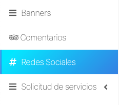
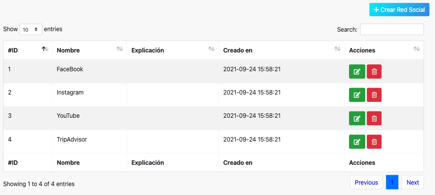
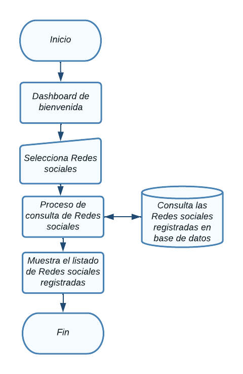
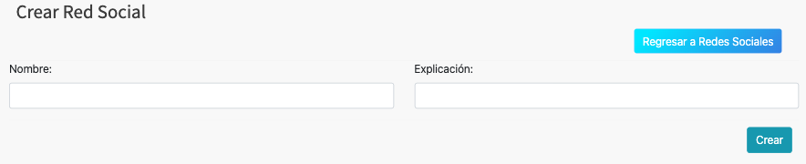
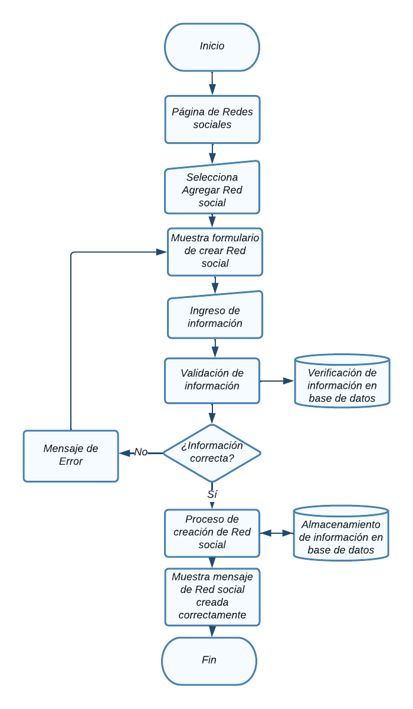
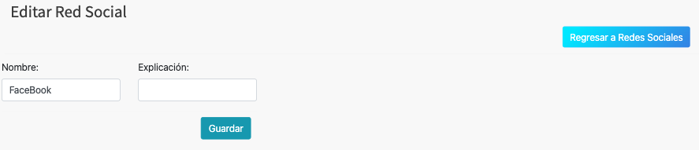
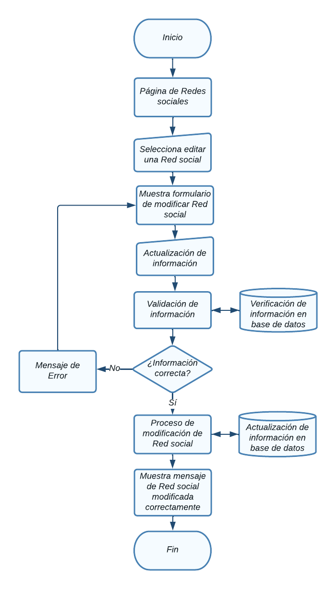
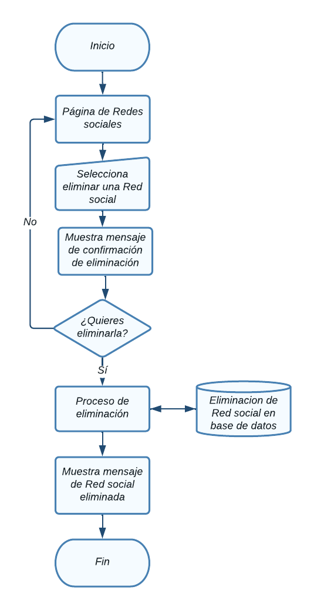

# Redes sociales

En esta sección se abordarán el Módulo de redes sociales.

Para acceder a cada uno, haga clic en el módulo Componentes -> redes sociales.

  

NOTA: Debe tener un rol como *super_admin*, o tener un perfil con los permisos
necesarios para poder crear redes sociales, roles y permisos.

## Tabla de contenido

- [Redes sociales](#redes-sociales)
  - [Tabla de contenido](#tabla-de-contenido)
  - [Consultar redes sociales](#consultar-redes-sociales)
    - [Diagrama de flujo - Ver redes sociales](#diagrama-de-flujo---ver-redes-sociales)
  - [Agregar red social](#agregar-red-social)
    - [Diagrama de flujo - Agregrar red social](#diagrama-de-flujo---agregrar-red-social)
  - [Modificar red social](#modificar-red-social)
    - [Diagrama de flujo - Modificación de red social](#diagrama-de-flujo---modificación-de-red-social)
  - [Eliminación de  red social](#eliminación-de--red-social)
    - [Diagrama de flujo - Eliminación de red social](#diagrama-de-flujo---eliminación-de-red-social)

## Consultar redes sociales
Aparecerá en pantalla el listado de todas las red social registradas y la información relevante de cada una y las opciones agregar, modificar y eliminar, las cuales detallaremos a continuación. 

### Diagrama de flujo - Ver redes sociales

## Agregar red social
Desde la sección de redes sociales de clic en el botón **Agregar red social**, lo llevara a la sección **Crear red social.**  

Aparecerá el siguiente formulario con diversos campos importantes para el
registro de nuevas redes sociales

Al finalizar el llenado de los campos es necesario dar clic en **Submit**, de lo contrario los cambios no se verán reflejados

### Diagrama de flujo - Agregrar red social

## Modificar red social
Desde la sección de redes sociales de clic en **Editar red social** de la red social que desea modificar y lo llevara a la sección **Modificar red social.**  

Aparecerá el siguiente formulario con la información de la red social.

Al finalizar el llenado de los campos es necesario dar clic en **Submit**, de lo contrario los cambios no se verán reflejados

### Diagrama de flujo - Modificación de red social

## Eliminación de  red social
Desde la sección de redes sociales de clic en el botón **Eliminar** de la red social que desea eliminar y le mostrará un mensaje de confirmación

Aparecerá el siguiente mensaje de confirmación:

Puede cancelar la acción si no esta seguro de eliminar el registro, al dar click en el botón **Ok** la red social se eliminará y no se podrá recuperar el registro.

### Diagrama de flujo - Eliminación de red social
