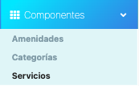
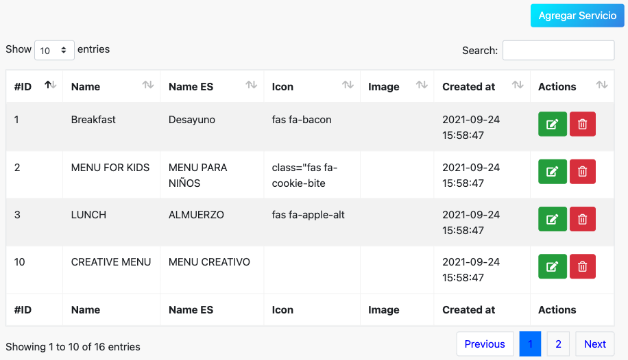
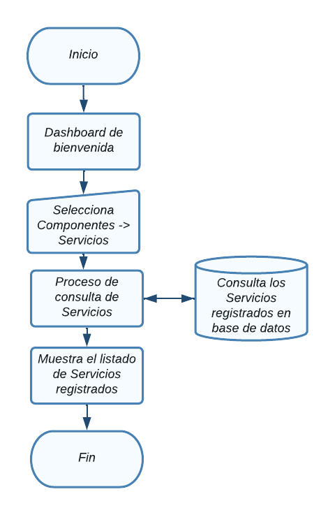
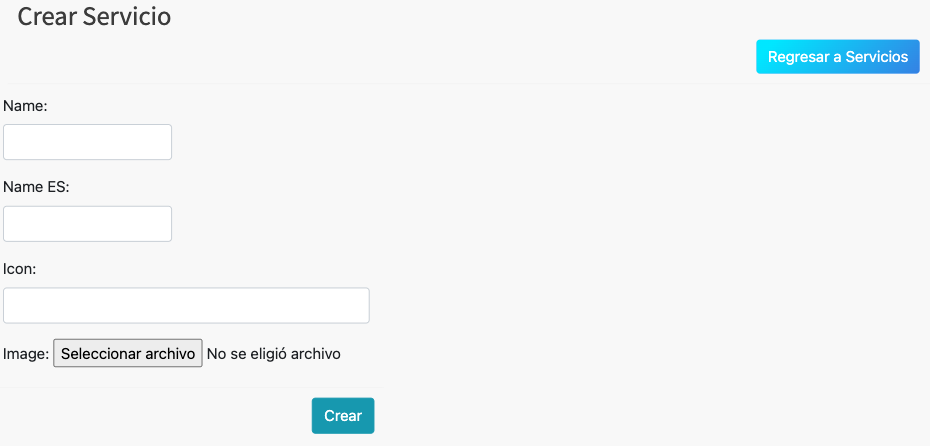
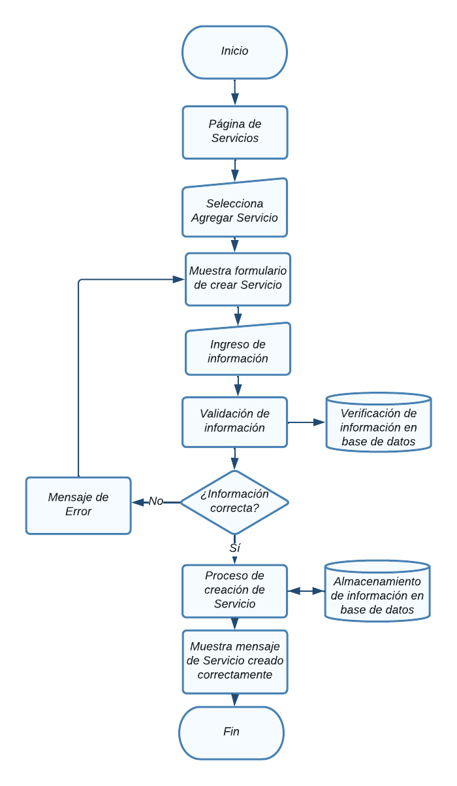
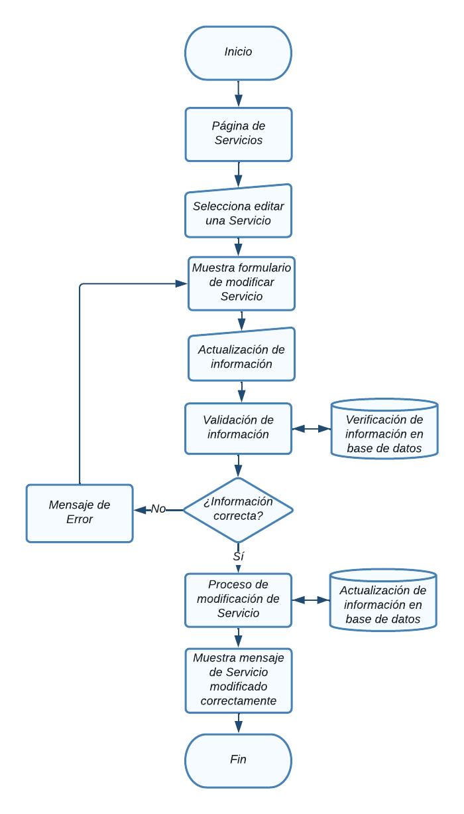
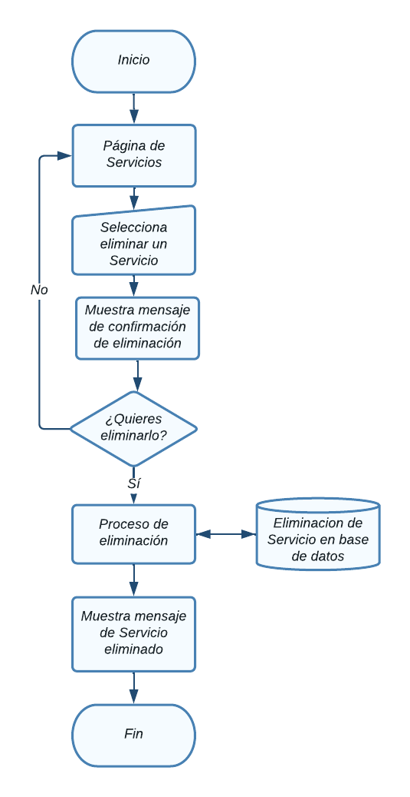

# Servicios

En esta sección se abordarán el Módulo de servicios.

Para acceder a cada uno, haga clic en el módulo Componentes ->  servicios.

  

NOTA: Debe tener un rol como *super_admin*, o tener un perfil con los permisos
necesarios para poder crear servicios, roles y permisos.

## Tabla de contenido

- [Servicios](#servicios)
  - [Tabla de contenido](#tabla-de-contenido)
  - [Consultar servicios](#consultar-servicios)
    - [Diagrama de flujo - Ver servicios](#diagrama-de-flujo---ver-servicios)
  - [Agregar servicio](#agregar-servicio)
    - [Diagrama de flujo - Agregrar servicio](#diagrama-de-flujo---agregrar-servicio)
  - [Modificar servicio](#modificar-servicio)
    - [Diagrama de flujo - Modificación de servicio](#diagrama-de-flujo---modificación-de-servicio)
  - [Eliminación de  servicio](#eliminación-de--servicio)
    - [Diagrama de flujo - Eliminación de servicio](#diagrama-de-flujo---eliminación-de-servicio)

## Consultar servicios
Aparecerá en pantalla el listado de todas las servicios registradas y la información relevante de cada una y las opciones agregar, modificar y eliminar, las cuales detallaremos a continuación. 

### Diagrama de flujo - Ver servicios

## Agregar servicio
Desde la sección de servicios de clic en el botón **Agregar servicio**, lo llevara a la sección **Crear servicio.**  

Aparecerá el siguiente servicio con diversos campos importantes para el
registro de nuevos servicios

Al finalizar el llenado de los campos es necesario dar clic en **Submit**, de lo contrario los cambios no se verán reflejados

### Diagrama de flujo - Agregrar servicio

## Modificar servicio
Desde la sección de servicios de clic en **Editar servicio** del servicio que desea modificar y lo llevara a la sección **Modificar servicio.**  

Aparecerá el siguiente servicio con la información del servicio.

Al finalizar el llenado de los campos es necesario dar clic en **Submit**, de lo contrario los cambios no se verán reflejados

### Diagrama de flujo - Modificación de servicio

## Eliminación de  servicio
Desde la sección de servicios de clic en el botón **Eliminar** del servicio que desea eliminar y le mostrará un mensaje de confirmación

Aparecerá el siguiente mensaje de confirmación:

Puede cancelar la acción si no esta seguro de eliminar el registro, al dar click en el botón **Ok** el servicio se eliminará y no se podrá recuperar el registro.

### Diagrama de flujo - Eliminación de servicio
