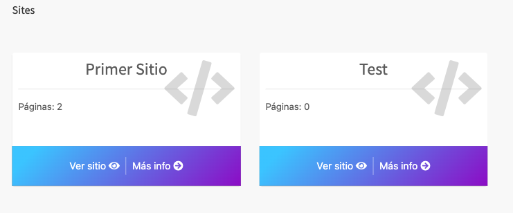
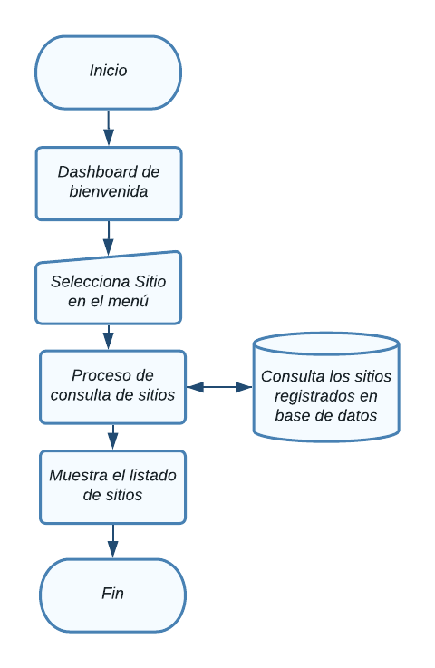
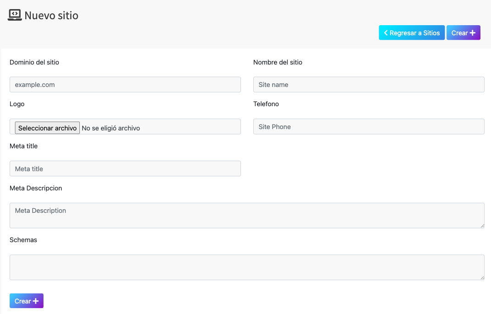
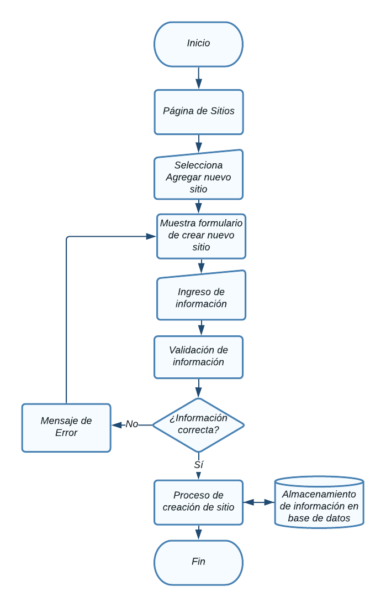
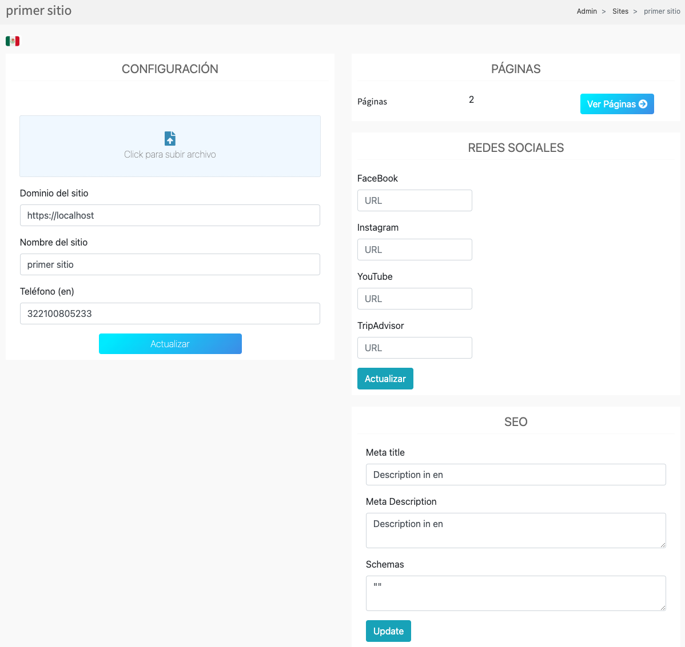

# Sitios

En esta sección se abordarán el módulo de Sitios

<!--  -->
  

NOTA: Debe tener un rol como *super_admin*, o tener un perfil con los permisos
necesarios para poder crear y editar sitios.

## Tabla de contenido

- [Sitios](#sitios)
  - [Tabla de contenido](#tabla-de-contenido)
  - [Sitios](#sitios-1)
    - [Glosario de clases](#glosario-de-clases)
      - [Diagrama de flujo - Ver sitios](#diagrama-de-flujo---ver-sitios)
    - [Agregar sitio](#agregar-sitio)
      - [Diagrama de flujo - Agregrar sitio](#diagrama-de-flujo---agregrar-sitio)
    - [Modificar sitio](#modificar-sitio)
      - [Diagrama de flujo - Modificación de sitio](#diagrama-de-flujo---modificación-de-sitio)

## Sitios
Aparecerá en pantalla el listado de todos los sitios registrados con acceso al CMS, la información relevante de cada uno y las opciones agregar, modificar, ver actividad
y eliminar, las cuales detallaremos a continuación. 

### Glosario de clases
glosario de clases

#### Diagrama de flujo - Ver sitios

### Agregar sitio
Desde la sección de sitios de clic en el botón **Agregar sitio**, lo llevara a la sección **Crear sitio.**  

Aparecerá el siguiente formulario con diversos campos importantes para el
registro de nuevos sitios

El campo "*Email address*", es el email con el que se ingresara al CMS junto con el campo contraseña.  

Es necesario seleccionar un **Rol** adecuado para el sitio, esto limitara las acciones que puede realizar dentro el CMS.  

Si no se encuentra el **Rol** indicado, pueds crearlo, para esto, revise la sub sección [Roles](#roles).  
En el apartado "*Sites*" se puede seleccionar los sitios a los que este sitio tendrá acceso.

Al finalizar el llenado de los campos es necesario dar clic en **Submit**, de lo contrario los cambios no se verán reflejados

#### Diagrama de flujo - Agregrar sitio

### Modificar sitio
Desde la sección de sitios de clic en **Editar sitio** del sitio que desea modificar y lo llevara a la sección **Modificar sitio.**  

Aparecerá el siguiente formulario con la información del sitio.

Al finalizar el llenado de los campos es necesario dar clic en **Submit**, de lo contrario los cambios no se verán reflejados

#### Diagrama de flujo - Modificación de sitio

