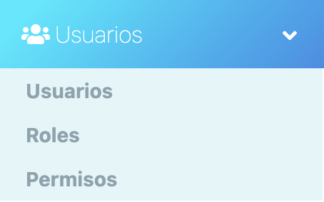
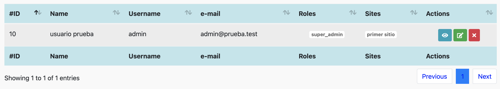
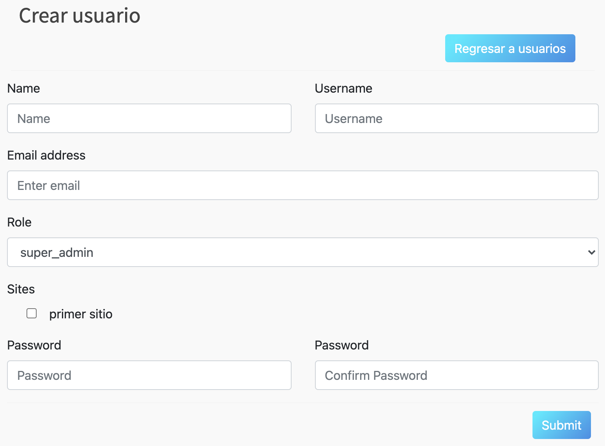

# Usuarios

En esta sección se abordarán el Módulo de Usuarios con sus respectivos
submódulos: Usuarios y Perfiles.  
Para acceder a cada uno, haga clic en el
módulo Usuarios, este desplegara los submódulos y solo requerirá dar otro clic
en el submódulo al que desee ingresar.  

  

NOTA: Debe tener un rol como *super_admin*, o tener un perfil con los permisos
necesarios para poder crear usuarios, roles y permisos.

## Tabla de contenido

- [Usuarios](#usuarios)
  - [Tabla de contenido](#tabla-de-contenido)
  - [Usuarios](#usuarios-1)
    - [Agregar Usuario](#agregar-usuario)
      - [Diagrama de flujo](#diagrama-de-flujo)
  - [Roles](#roles)
  - [Permisos](#permisos)

## Usuarios
Aparecerá en pantalla el listado de todos los usuarios registrados con acceso al CMS, la información relevante de cada uno y las opciones agregar, modificar, ver actividad
y eliminar, las cuales detallaremos a continuación. 

### Agregar Usuario
De clic en el botón **Agregar Usuario**, lo llevara a la sección **Crear Usuario.**  

Aparecerá el siguiente formulario con diversos campos importantes para el
registro de nuevos usuarios

El campo "*Email address*", es el email con el que se ingresara al CMS junto con el campo contraseña.  

Es necesario seleccionar un **Rol** adecuado para el usuario, esto limitara las acciones que puede realizar dentro el CMS.  

Si no se encuentra el **Rol** indicado, pueds crearlo, para esto, revise la sub sección [Roles](#roles).  
En el apartado "*Sites*" se puede seleccionar los sitios a los que este usuario tendrá acceso.

Al finalizar el llenado de los campos es necesario dar clic en **Submit**, de lo contrario los cambios no se verán reflejados

#### Diagrama de flujo

## Roles
Aparecerá en pantalla el listado de todos los roles de los usuarios registrados

## Permisos
Aparecerá en pantalla el listado de todos los roles de los usuarios registrados

