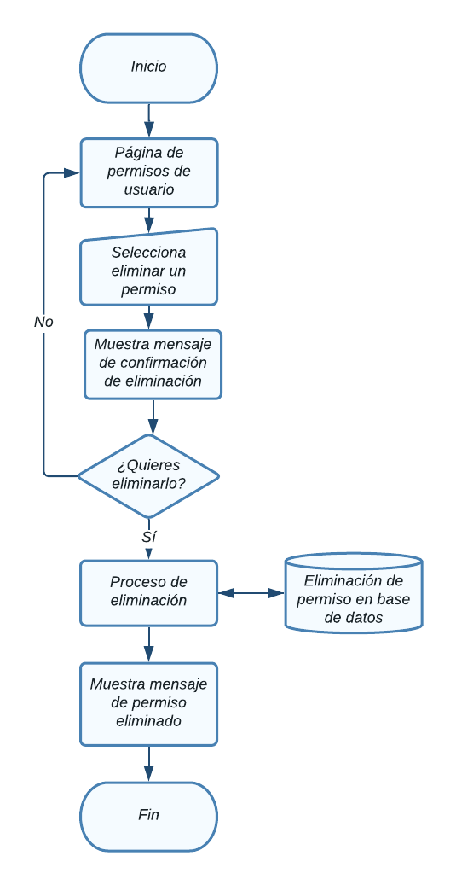

# Usuarios

En esta sección se abordarán el Módulo de Usuarios con sus respectivos
submódulos: Usuarios y Perfiles.  
Para acceder a cada uno, haga clic en el
módulo Usuarios, este desplegara los submódulos y solo requerirá dar otro clic
en el submódulo al que desee ingresar.  

  

NOTA: Debe tener un rol como *super_admin*, o tener un perfil con los permisos
necesarios para poder crear usuarios, roles y permisos.

## Tabla de contenido

- [Usuarios](#usuarios)
  - [Tabla de contenido](#tabla-de-contenido)
  - [Usuarios](#usuarios-1)
    - [Glosario de clases](#glosario-de-clases)
      - [Diagrama de flujo - Ver usuarios](#diagrama-de-flujo---ver-usuarios)
    - [Agregar Usuario](#agregar-usuario)
      - [Diagrama de flujo - Agregrar usuario](#diagrama-de-flujo---agregrar-usuario)
    - [Modificar Usuario](#modificar-usuario)
      - [Diagrama de flujo - Modificación de usuario](#diagrama-de-flujo---modificación-de-usuario)
    - [Eliminación de  Usuario](#eliminación-de--usuario)
      - [Diagrama de flujo - Eliminación de usuario](#diagrama-de-flujo---eliminación-de-usuario)
  - [Roles de usuario](#roles-de-usuario)
      - [Diagrama de flujo - Ver roles](#diagrama-de-flujo---ver-roles)
    - [Agregar rol](#agregar-rol)
      - [Diagrama de flujo - Agregrar rol](#diagrama-de-flujo---agregrar-rol)
    - [Modificar rol](#modificar-rol)
      - [Diagrama de flujo - Modificación de rol](#diagrama-de-flujo---modificación-de-rol)
    - [Eliminación de  rol](#eliminación-de--rol)
      - [Diagrama de flujo - Eliminación de rol](#diagrama-de-flujo---eliminación-de-rol)
  - [Permisos de usuario](#permisos-de-usuario)
      - [Diagrama de flujo - Ver permisos](#diagrama-de-flujo---ver-permisos)
    - [Agregar permiso](#agregar-permiso)
      - [Diagrama de flujo - Agregrar permiso](#diagrama-de-flujo---agregrar-permiso)
    - [Modificar permiso](#modificar-permiso)
      - [Diagrama de flujo - Modificación de permiso](#diagrama-de-flujo---modificación-de-permiso)
    - [Eliminación de  permiso](#eliminación-de--permiso)
      - [Diagrama de flujo - Eliminación de permiso](#diagrama-de-flujo---eliminación-de-permiso)

## Usuarios
Aparecerá en pantalla el listado de todos los usuarios registrados con acceso al CMS, la información relevante de cada uno y las opciones agregar, modificar, ver actividad
y eliminar, las cuales detallaremos a continuación. 

### Glosario de clases
glosario de clases

#### Diagrama de flujo - Ver usuarios

### Agregar Usuario
Desde la sección de Usuarios de clic en el botón **Agregar Usuario**, lo llevara a la sección **Crear Usuario.**  

Aparecerá el siguiente formulario con diversos campos importantes para el
registro de nuevos usuarios

El campo "*Email address*", es el email con el que se ingresara al CMS junto con el campo contraseña.  

Es necesario seleccionar un **Rol** adecuado para el usuario, esto limitara las acciones que puede realizar dentro el CMS.  

Si no se encuentra el **Rol** indicado, pueds crearlo, para esto, revise la sub sección [Roles](#roles).  
En el apartado "*Sites*" se puede seleccionar los sitios a los que este usuario tendrá acceso.

Al finalizar el llenado de los campos es necesario dar clic en **Submit**, de lo contrario los cambios no se verán reflejados

#### Diagrama de flujo - Agregrar usuario

### Modificar Usuario
Desde la sección de Usuarios de clic en **Editar Usuario** del usuario que desea modificar y lo llevara a la sección **Modificar Usuario.**  

Aparecerá el siguiente formulario con la información del usuario.

Al finalizar el llenado de los campos es necesario dar clic en **Submit**, de lo contrario los cambios no se verán reflejados

#### Diagrama de flujo - Modificación de usuario

### Eliminación de  Usuario
Desde la sección de Usuarios de clic en el botón **Eliminar** del usuario que desea eliminar y le mostrará un mensaje de confirmación

Aparecerá el siguiente mensaje de confirmación:

Puede cancelar la acción si no esta seguro de eliminar el registro, al dar click en el botón **Ok** el usuario se eliminará y no se podrá recuperar el registro.

#### Diagrama de flujo - Eliminación de usuario

## Roles de usuario
Aparecerá en pantalla el listado de todos los roles registrados, la información de cada uno y las opciones agregar, modificar, asignar permisos y eliminar, las cuales detallaremos a continuación. 

#### Diagrama de flujo - Ver roles

### Agregar rol
Desde la sección de roles de clic en el botón **Agregar rol**, lo llevara a la sección **Crear rol.**  

Aparecerá el siguiente formulario con diversos campos importantes para el
registro de nuevos roles

Al finalizar el llenado de los campos es necesario dar clic en **Crear**, de lo contrario los cambios no se verán reflejados

#### Diagrama de flujo - Agregrar rol

### Modificar rol
Desde la sección de roles de clic en **Editar rol** del rol que desea modificar y lo llevara a la sección **Editar rol.**  

Aparecerá el siguiente formulario con la información del rol.

Al finalizar el llenado de los campos es necesario dar clic en **Actualizar**, de lo contrario los cambios no se verán reflejados

#### Diagrama de flujo - Modificación de rol

### Eliminación de  rol
Desde la sección de roles de clic en el botón **Eliminar** del rol que desea eliminar y le mostrará un mensaje de confirmación

Aparecerá el siguiente mensaje de confirmación:

Puede cancelar la acción si no esta seguro de eliminar el registro, al dar click en el botón **Ok** el rol se eliminará y no se podrá recuperar el registro.

#### Diagrama de flujo - Eliminación de rol

## Permisos de usuario
Aparecerá en pantalla el listado de todos los permisos registrados, la información de cada uno y las opciones agregar, modificar y eliminar, las cuales detallaremos a continuación. 

#### Diagrama de flujo - Ver permisos

### Agregar permiso
Desde la sección de permisos de clic en el botón **Agregar permiso**, lo llevara a la sección **Crear permiso.**  

Aparecerá el siguiente formulario con diversos campos importantes para el
registro de nuevos permisos

Al finalizar el llenado de los campos es necesario dar clic en **Crear**, de lo contrario los cambios no se verán reflejados

#### Diagrama de flujo - Agregrar permiso

### Modificar permiso
Desde la sección de permisos de clic en **Editar permiso** del permiso que desea modificar y lo llevara a la sección **Editar permiso.**  

Aparecerá el siguiente formulario con la información del permiso.

Al finalizar el llenado de los campos es necesario dar clic en **Actualizar**, de lo contrario los cambios no se verán reflejados

#### Diagrama de flujo - Modificación de permiso

### Eliminación de  permiso
Desde la sección de permisos de clic en el botón **Eliminar** del permiso que desea eliminar y le mostrará un mensaje de confirmación

Aparecerá el siguiente mensaje de confirmación:

Puede cancelar la acción si no esta seguro de eliminar el registro, al dar click en el botón **Ok** el permiso se eliminará y no se podrá recuperar el registro.

#### Diagrama de flujo - Eliminación de permiso

[]